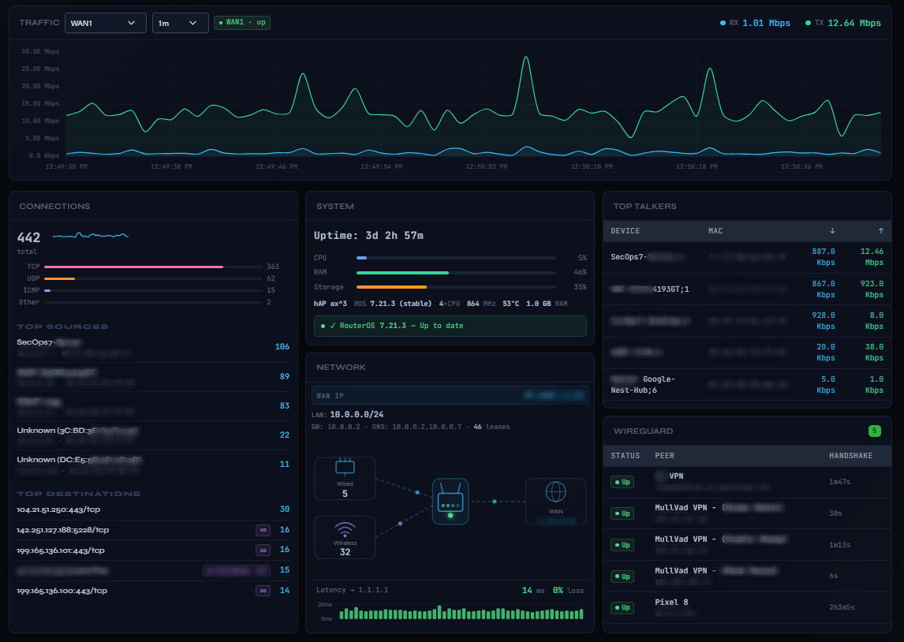
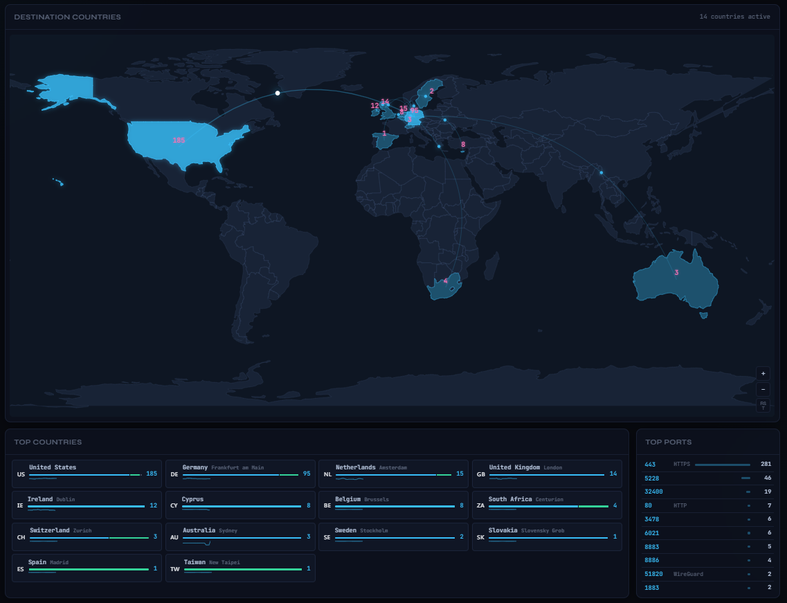
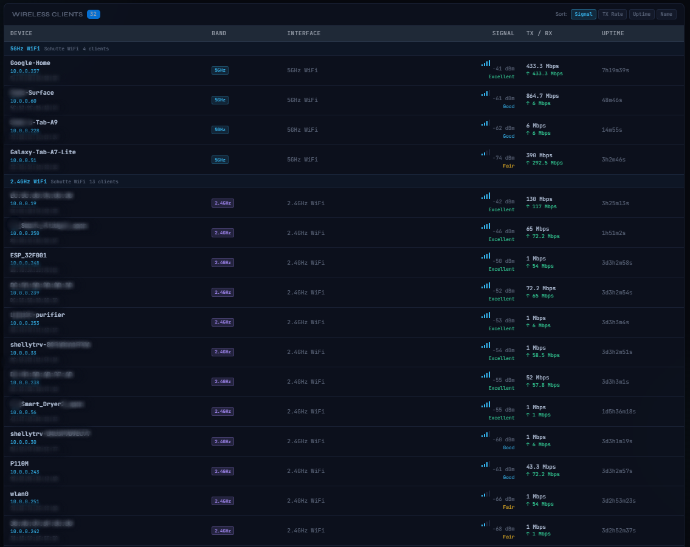
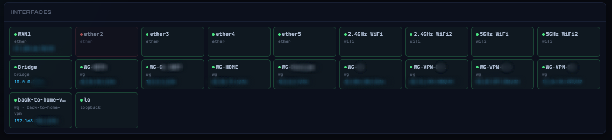
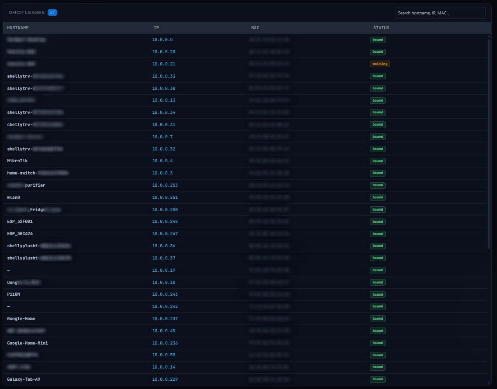
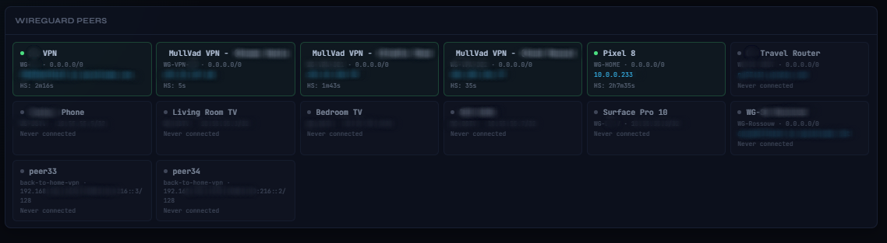

# MikroDash
### The Ultimate MikroTik RouterOS Dashboard.

> Real-time MikroTik RouterOS v7 dashboard — streaming binary API, Socket.IO, Docker-ready.

MikroDash connects directly to the RouterOS API over a persistent binary TCP connection, streaming live data to the browser via Socket.IO. No page refreshes. No agents. Just plug in your router credentials and go.

[](LICENSE)

---

## Screenshots

### Dashboard


### Connections Map


### Wireless Clients


### Network Diagram


### DHCP Leases


### VPN / WireGuard


---

## Features

### Dashboard
- **Live traffic chart** — per-interface RX/TX Mbps with configurable history window (1m–30m)
- **System card** — CPU, RAM, Storage gauges with colour-coded thresholds (amber >75%, red >90%), board info, temperature, uptime chip
- **RouterOS update indicator** — shows installed vs available version side by side
- **Network card** — animated SVG topology diagram with live wired/wireless client counts, WAN IP, LAN subnets, and latency chart (ping to 1.1.1.1)
- **Connections card** — total connection count sparkline, protocol breakdown bars (TCP/UDP/ICMP), top sources with hostname resolution, top destinations with geo-IP country flags
- **Top Talkers** — top 5 devices by active traffic with RX/TX rates
- **WireGuard card** — active peer list with status and last handshake

### Pages
| Page | Description |
|---|---|
| Wireless | Clients grouped by interface with signal quality, band badge (2.4/5/6 GHz), IP, TX/RX rates, and sortable columns |
| Interfaces | All interfaces as compact tiles with status, IP, live rates, and cumulative RX/TX totals |
| DHCP | Active DHCP leases with hostname, IP, MAC, and expiry |
| VPN | All WireGuard peers (active + idle) as tiles sorted active-first, with allowed IPs, endpoint, handshake, and traffic counters |
| Connections | World map with animated arcs to destination countries, per-country protocol breakdown, sparklines, top ports panel, and click-to-filter |
| Firewall | Top hits, Filter, NAT, and Mangle rule tables with packet counts |
| Logs | Live router log stream with severity filter and text search |

### Notifications
- Bell icon in topbar opens an alert history panel showing the last 50 alerts with timestamps
- Browser push notifications (when permitted) for:
  - Interface down / back up
  - WireGuard peer disconnected / reconnected
  - CPU exceeds 90% (1-minute cooldown)
  - 100% ping loss to 1.1.1.1

---

## Quick Start

```bash
cp .env.example .env
# Edit .env — set ROUTER_HOST, ROUTER_USER, ROUTER_PASS, DEFAULT_IF
docker compose up -d
```

- Dashboard: `http://localhost:3081`
- Health check: `http://localhost:3081/healthz`

---

## RouterOS Setup

Create a read-only API user (recommended):

```
/ip service set api port=8728 disabled=no
/user group add name=mikrodash policy=read,api,!local,!telnet,!ssh,!ftp,!reboot,!write,!policy,!test,!winbox,!web,!sniff,!sensitive,!romon,!rest-api
/user add name=mikrodash group=mikrodash password=your-secure-password
```

To use API-SSL (TLS) instead, enable the ssl service and set `ROUTER_TLS=true` in your `.env`:

```
/ip service set api-ssl disabled=no port=8729
```

---

## Environment Variables

```env
PORT=3081                    # HTTP port MikroDash listens on
ROUTER_HOST=192.168.88.1     # RouterOS IP or hostname
ROUTER_PORT=8728             # API port (8728 plain, 8729 TLS)
ROUTER_TLS=false             # Set true to use API-SSL
ROUTER_TLS_INSECURE=false    # Skip TLS cert verification (self-signed certs)
ROUTER_USER=mikrodash        # API username
ROUTER_PASS=change-me        # API password
DEFAULT_IF=ether1            # Default interface shown in traffic chart
HISTORY_MINUTES=30           # Traffic chart history window

# Polling intervals (ms)
CONNS_POLL_MS=3000
KIDS_POLL_MS=3000
DHCP_POLL_MS=15000
LEASES_POLL_MS=15000
ARP_POLL_MS=30000
SYSTEM_POLL_MS=3000
WIRELESS_POLL_MS=5000
VPN_POLL_MS=10000
FIREWALL_POLL_MS=10000
IFSTATUS_POLL_MS=5000
PING_POLL_MS=10000

# Ping target for latency monitor
PING_TARGET=1.1.1.1

# Top-N limits
TOP_N=10
TOP_TALKERS_N=5
FIREWALL_TOP_N=15
```

---

## Architecture

### Streamed (router pushes on change — zero poll overhead)
| Data | RouterOS endpoint |
|---|---|
| WAN Traffic RX/TX | `/interface/monitor-traffic` |
| Router Logs | `/log/listen` |
| DHCP Lease changes | `/ip/dhcp-server/lease/listen` |

### Polled (concurrent via tagged API multiplexing)
| Collector | Interval | Data |
|---|---|---|
| System | 3s | CPU, RAM, storage, temp, ROS version |
| Connections | 3s | Firewall connection table, geo-IP |
| Top Talkers | 3s | Kid Control traffic stats |
| Wireless | 5s | Wireless client list |
| Interface Status | 5s | Interface state, IPs, rx/tx bytes |
| VPN | 10s | WireGuard peers, rx/tx rates |
| Firewall | 10s | Rule hit counts |
| Ping | 10s | RTT + packet loss to PING_TARGET |
| DHCP Networks | 15s | LAN subnets, WAN IP |
| DHCP Leases | 15s | Active lease table |
| ARP | 30s | MAC to IP mappings |

All collectors run **concurrently** on a single TCP connection — no serial queuing.

---

## Keyboard Shortcuts

| Key | Page |
|---|---|
| `1` | Dashboard |
| `2` | Wireless |
| `3` | Interfaces |
| `4` | DHCP |
| `5` | VPN |
| `6` | Connections |
| `7` | Firewall |
| `8` | Logs |
| `/` | Focus log search |

---

## License

MIT — see [LICENSE](LICENSE)

Third-party attributions — see [THIRD_PARTY_NOTICES](THIRD_PARTY_NOTICES)

---

## Disclaimer

MikroDash is an independent, community-built project and is **not affiliated with, endorsed by, or associated with MikroTik SIA** in any way. MikroTik and RouterOS are trademarks of MikroTik SIA. All product names and trademarks are the property of their respective owners.
